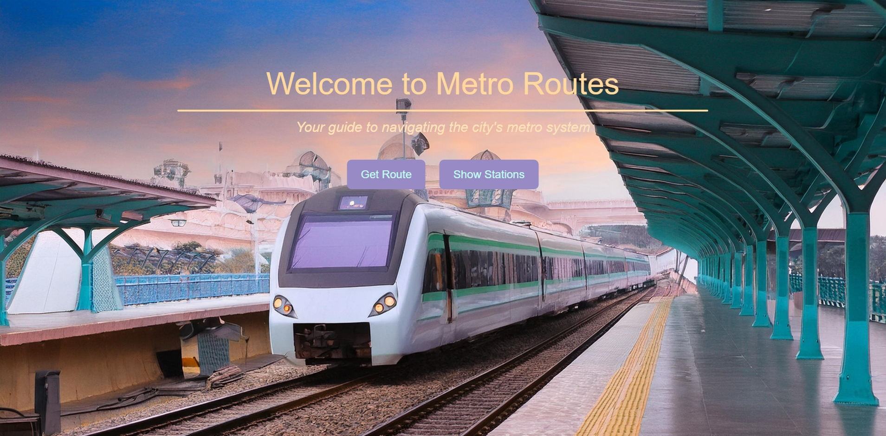
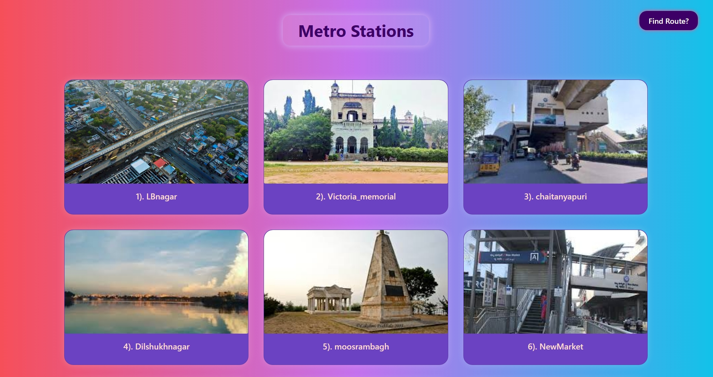
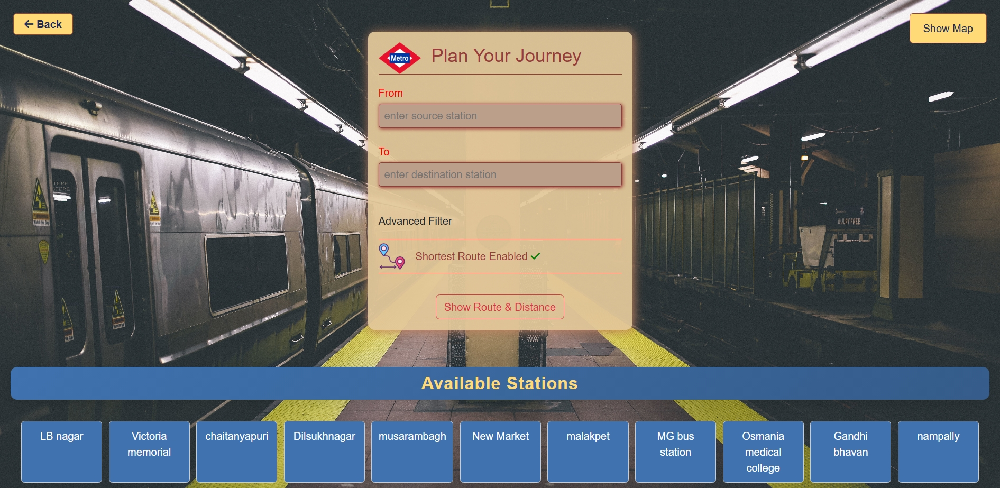
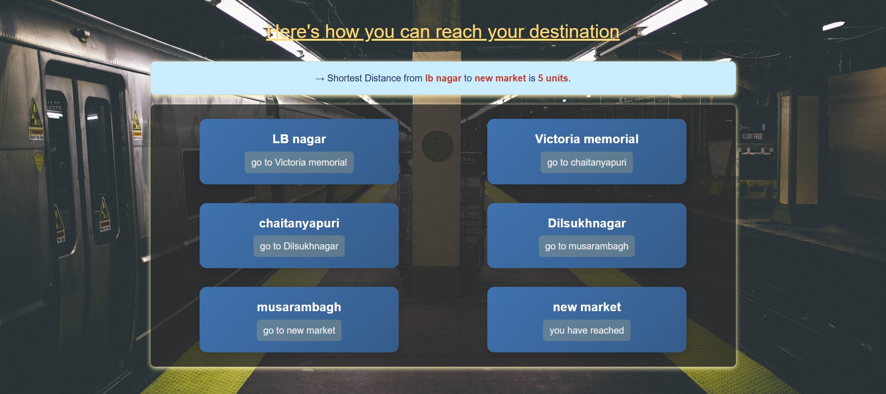
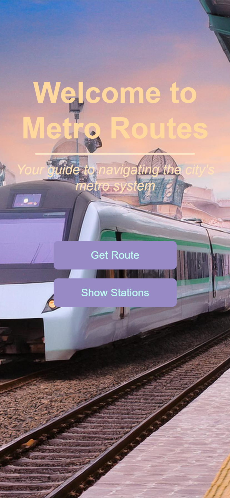
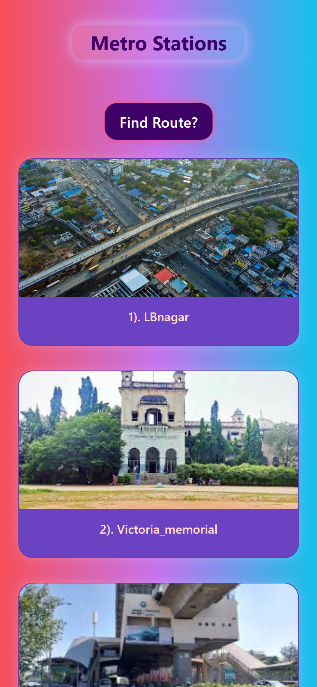
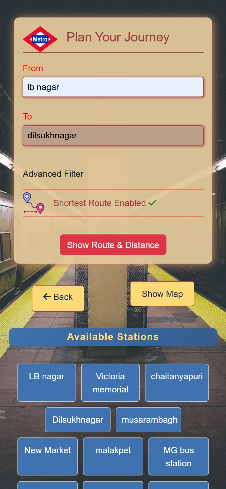
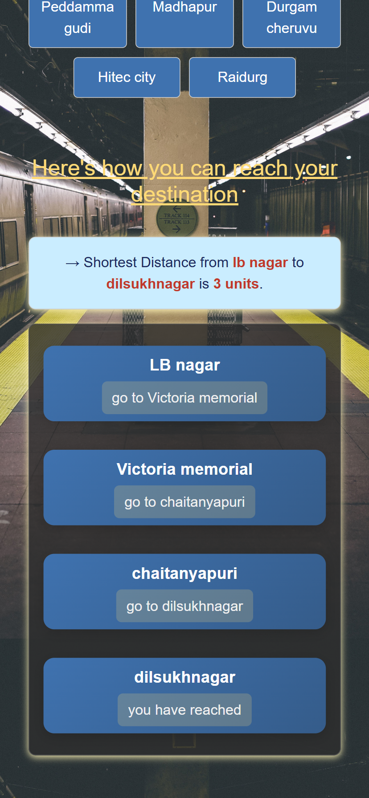

# 🚇 Metro Path Finder – Hyderabad Metro

**Metro Path Finder** is a web-based application that helps users find the **shortest route** between two metro stations in Hyderabad using **Dijkstra's Algorithm**. Designed with a clean, interactive UI, the app is fully responsive and works smoothly on all screen sizes.

---

## 🌐 Live Demo

🔗 [Launch App](https://nikhil-karoriya.github.io/Metro-Path-Finder/index.html)

---

## 📸 Preview

### 🖥️ Wide Screen View

| Home Screen | Station List | Route Form | Route Result |
|-------------|--------------|------------|--------------|
|  |  |  |  |

---

### 📱 Mobile View

| Home Screen | Station List | Route Form | Route Result |
|-------------|--------------|------------|--------------|
|  |  |  |  |

Explore the app’s consistent experience across devices with dynamic cards and smooth transitions.

---

## 🚀 Features

- 🔍 **Shortest Path Calculation** using Dijkstra's Algorithm
- 🗺️ Covers **56 Metro Stations** from Hyderabad
- 📱 **Fully Responsive UI** – works seamlessly on mobile and desktop
- 🎴 **Card-Based Visualization** for routes and steps
- 📌 **Interactive Map Button** toggle
- ⚡ **Real-Time Results** without page reloads  

---

## 🛠️ Tech Stack

- **HTML5** – Layout and structure  
- **CSS3** – Responsive design and visual styling  
- **JavaScript (ES6)** – Core logic, station handling, Dijkstra’s algorithm  
- **Bootstrap 5** – Responsive form elements and buttons  
- **Dijkstra’s Algorithm** – For efficient pathfinding
---

## 🧠 How It Works

1. Each metro station is modeled as a **node in a graph**.
2. The shortest path is calculated using **Dijkstra’s Algorithm**.
3. The computed path is shown as a series of styled **station cards**.

---

## Station Codes
    Node number                                       Station Name
    
        1                                              LBnagar
        2                                              Victoria_memorial
        3                                              Chaitanyapuri
        4                                              Dilshukhnagar
        5                                              Moosrambagh
        6                                              New Market
        7                                              Malakpet
        8                                              MG BusStation
        9                                             Osmania_medical
        10                                             GandhiBhavan
        11                                             Assembly
        12                                             Lakdikapool
        13                                             Khairtabad
        14                                             Irrummanzil
        15                                             Panjagutta
        16                                             Ameerpet
        17                                             SRnagar
        18                                             ESIhospital
        20                                             Erragadda
        21                                             Bharatnagar
        22                                             Moosapet
        23                                             DR_BRambedkar
        24                                             Kukatpally
        25                                             KPHBcolony
        26                                             JNTUcollege
        27                                             Miyapur
        28                                             Sultanbazar
        29                                             Narayanguda
        30                                             Chikkadpali
        31                                             RTCxroads
        32                                             Musheerabad
        33                                             Gandhihospital
        34                                             SecundrabadWest
        35                                             Paradeground
        36                                             Nagole
        37                                             Uppal
        38                                             stadium
        39                                             NGRI
        40                                             Habsiguda
        41                                             Tarnaka
        42                                             Mettuguda
        43                                             SecuderabadeEast
        44                                             Paradise
        45                                             Rasoolpura
        46                                             PrakashNagar
        47                                             Begumpet
        48                                             MathuraNagar
        49                                             Yusufguda
        50                                             Jubliehills
        51                                             JH-checkpost
        52                                             Peddamagudi
        53                                             Madhapur
        54                                             Dugamcheruvu
        55                                             Hitechcity
        56                                             Raidurg
