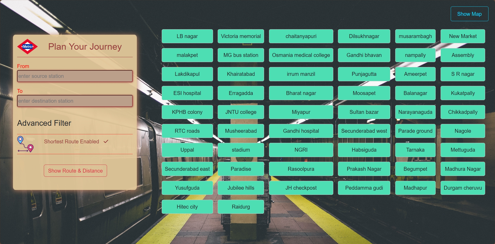
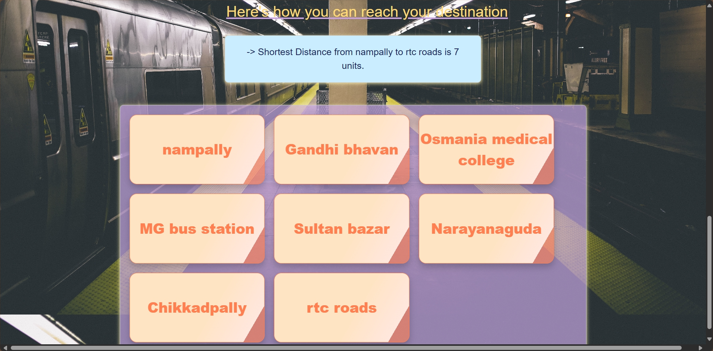

# 🚇 Metro Path Finder – Hyderabad Metro 

**Metro Path Finder** is a web-based application that allows users to find the **shortest path** between two metro stations in Hyderabad using **Dijkstra's Algorithm**. The app is built using **HTML, CSS, and JavaScript**, offering an intuitive interface to explore 56 Hyderabad Metro stations.

---

## 🌐 Live Demo
🔗 [View Live Application](https://nikhil-karoriya.github.io/Metro-Path-Finder/) <!-- Replace with actual link if hosted -->

---

## 📸 Preview

---

## 🚀 Features

- 🔍 **Shortest Path Finder**: Enter a source and destination station to find the shortest path based on distance using Dijkstra’s Algorithm.
- 📍 **56 Hyderabad Metro Stations**: Covers all key stations from the Hyderabad Metro Rail network.
- 🧭 **Path Display**: Shows step-by-step stations to travel, styled in **interactive card format**.
- ⚡ **Real-Time Response**: Fast algorithmic calculation and UI rendering of paths.
---

## 🛠️ Technologies Used

- **HTML5** – Structure of the user interface  
- **CSS3** – Styling, layout, and responsive design  
- **JavaScript (ES6)** – DOM manipulation, logic, and Dijkstra’s implementation  
- **Dijkstra’s Algorithm** – Graph-based shortest path calculation  

---

## 🧠 How It Works

1. The metro system is modeled as a **graph** where each station is a node.
2. When a user inputs a **source** and **destination**, Dijkstra’s algorithm computes the **shortest distance** path.
3. The resulting path and all intermediate stations are displayed in a **card-style UI**.

---

## 📂 Project Structure

Metro-Path-Finder/
├── index.html           
├── style.css            
├── script.js            
├── dijkstra.js          
├── stations.js          
├── assets/
│   └── screenshot.png   
├── README.md            

## Here's how metro station looks like in the form of graph :

# STATION CODES
        Node number                                       Station Name
        
            1                                              LBnagar
            2                                              Victoria_memorial
            3                                              Chaitanyapuri
            4                                              Dilshukhnagar
            5                                              Moosrambagh
            6                                              New Market
            7                                              Malakpet
            8                                              MG BusStation
            9                                             Osmania_medical
            10                                             GandhiBhavan
            11                                             Assembly
            12                                             Lakdikapool
            13                                             Khairtabad
            14                                             Irrummanzil
            15                                             Panjagutta
            16                                             Ameerpet
            17                                             SRnagar
            18                                             ESIhospital
            20                                             Erragadda
            21                                             Bharatnagar
            22                                             Moosapet
            23                                             DR_BRambedkar
            24                                             Kukatpally
            25                                             KPHBcolony
            26                                             JNTUcollege
            27                                             Miyapur
            28                                             Sultanbazar
            29                                             Narayanguda
            30                                             Chikkadpali
            31                                             RTCxroads
            32                                             Musheerabad
            33                                             Gandhihospital
            34                                             SecundrabadWest
            35                                             Paradeground
            36                                             Nagole
            37                                             Uppal
            38                                             stadium
            39                                             NGRI
            40                                             Habsiguda
            41                                             Tarnaka
            42                                             Mettuguda
            43                                             SecuderabadeEast
            44                                             Paradise
            45                                             Rasoolpura
            46                                             PrakashNagar
            47                                             Begumpet
            48                                             MathuraNagar
            49                                             Yusufguda
            50                                             Jubliehills
            51                                             JH-checkpost
            52                                             Peddamagudi
            53                                             Madhapur
            54                                             Dugamcheruvu
            55                                             Hitechcity
            56                                             Raidurg
